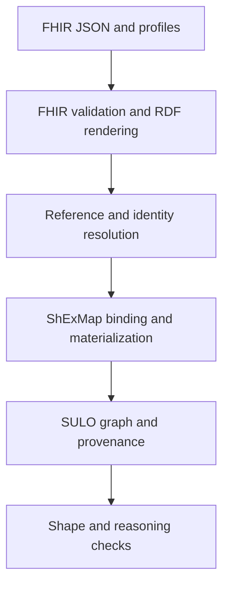

# FHIR to SULO through ShExMap: concept note

**Draft — 29 September 2026**  
**Purpose:** a reviewable semantic and technical contract for a profile-specific FHIR-to-SULO pilot in AIDAVA. The accompanying [implementation plan](FHIR_to_SULO_Multiagent_Implementation_Plan.md) turns this contract into parallel work packages.

## 1. Proposition

Represent each selected FHIR resource in two linked layers:

1. **Source layer:** retain the original FHIR resource, release, profile, resource/version identifier, status, codes, literal values, and extensions. An HL7 FHIR RDF rendering supplies the graph that ShExMap validates; the original JSON may also be retained for exact FHIR exchange.
2. **Semantic layer:** materialize an explicitly justified SULO graph of information objects, qualities, quantities, processes, objects, time, and PRO roles. Link each produced assertion to the source and mapping activity.

The core transformation is a pair of ShEx schemas using shared `%Map:{ … %}` variables: validate a FHIR RDF shape to extract a **structured binding tree**, then materialize a SULO target shape. A small host service selects the map, resolves references and identities, supplies terminology mappings, and manages provenance and validation. The host must not contain a second library of ad hoc FHIR-to-SULO triple rules.

This distinction follows FHIR's own warning that its resource graph describes clinical *records*, while research ontologies often describe entities and events. A `Patient` resource is not identical to a person; an `Observation` is not identical to the quality observed; and a recorded `Condition` is not automatically a true diagnosis. [FHIR RDF § relationship with ontologies](https://hl7.org/fhir/R4/rdf.html#relationship) explains the records/facts issue. SULO's [SOLID and PRO patterns](https://ceur-ws.org/Vol-4176/foust-7.pdf) provide the target modeling discipline.

## 2. Scope and rules

**Initial profile:** FHIR R4 Observation and Encounter with a pinned set of profiles and codes. The R5 extension is a separate compatibility milestone; names such as `effective[x]` and `occurrence[x]` vary by release. The pilot uses synthetic data. `MedicationAdministration` is the first process extension after the initial two resources.

**Semantic rules**

- Treat the FHIR resource and its semantic interpretation as distinct individuals. Preserve evidence, status, and uncertainty. Never assert `owl:sameAs` between a FHIR resource and a person, process, or quality.
- Use `sulo:hasValue` for literals on information objects. Under SOLID, a `sulo:Quantity` is an information object with a value and unit and `sulo:refersTo` the relevant quality; the quality is a feature of its bearer.
- Use PRO for contextual participation: a process `sulo:hasParticipant` a typed role and the role `sulo:isFeatureOf` its holder. The SULO role chain can infer direct participation. Do not introduce `hasPatient` or resource-specific shortcuts.
- Use domain classes for specific observable qualities, processes, and roles, while keeping SULO's upper-level predicates. A code-to-class interpretation needs a reviewed terminology rule; a FHIR code literal alone is not an OWL class assertion.
- Distinguish observation `effective[x]` (clinically relevant time) from `issued` (availability of the result) and `meta.lastUpdated` (resource version update). Preserve time precision and unknown endpoints.
- Never drop a comparator, absent-value reason, method, unit code/system, component association, or a modifier extension while claiming an unqualified numeric result. Unsupported cases are rejected or represented only in the source/record layer.
- A status of `entered-in-error` suppresses clinical assertions from that resource; it does not erase the source record. Corrections must retract or replace the affected derived triples for the resource version.

## 3. Runtime boundary



**ShExMap owns** source shape matching; shared variable binding; preservation of repetition scopes; production of target triples, named or keyed nodes, SOLID structures, and PRO structures; and mapping-level failure reports. Current ShEx.js documentation describes iteration scopes, `id(...)` identities, static analysis, per-quad lineage, and in-place graph updates ([iteration scopes](https://github.com/shexjs/shex.js/blob/main/packages/extension-map/doc/iteration-scopes.md)).

**The host owns** FHIR acquisition and release/profile validation; JSON-to-FHIR-RDF conversion; reference resolution and person identity policy; map selection; terminology/UCUM lookups; named graph versioning and PROV-O activity metadata; post-materialization checks; batching, retries, access control, and monitoring. An external lookup must supply a value or fail explicitly; it must not silently change the target semantics.

The [ShExMap Repository](https://github.com/micheldumontier/shexmap-repository) is the authoring and versioning interface for mapping pairs. The execution service pins a reviewed pairing version. SULOizer can orchestrate this as one transformation family; the ShExMap engine remains the source of its FHIR-to-SULO assertions.

## 4. Worked example A: eGFR result using SOLID

This synthetic FHIR R4 resource represents a **reported estimate**, not an asserted physiological fact independent of the record. The chosen LOINC and UCUM examples follow HL7's [eGFR example](https://hl7.org/fhir/R4/observation-example-f205-egfr.html), but the value and date here are synthetic.

```json
{
  "resourceType": "Observation",
  "id": "egfr-456",
  "meta": {"versionId": "1"},
  "status": "final",
  "code": {"coding": [{"system": "http://loinc.org", "code": "33914-3"}]},
  "subject": {"reference": "Patient/p123"},
  "effectiveDateTime": "2026-09-02T14:00:00Z",
  "valueQuantity": {
    "value": 55.0,
    "unit": "mL/min/1.73 m2",
    "system": "http://unitsofmeasure.org",
    "code": "mL/min/{1.73_m2}"
  }
}
```

The source shape captures these *pivot bindings* from the FHIR RDF rendering:

| Shared binding | FHIR source | SULO target |
| --- | --- | --- |
| `egfr:source` | Observation resource/version IRI | lineage to source record |
| `egfr:subjectRef` | resolved `Observation.subject` | original FHIR Patient reference retained in lineage |
| `egfr:person` | identity service output for that reference, supplied as a run binding | person linked to the quality |
| `egfr:value` | `valueQuantity.value` | quantity `sulo:hasValue` |
| `egfr:unit` | UCUM system and code | unit identity and code |
| `egfr:effective` | `effectiveDateTime` | clinically relevant time |
| `egfr:code` | system and code | reviewed result/quality typing rule |

For clarity, the following **partial ShExMap fragments** show the value and unit binding; the complete shapes, code/status guards, reference handling, and node keys are Gate 2 deliverables. FHIR R4 RDF wraps primitive values under `fhir:value` (see the [R4 Turtle example](https://hl7.org/fhir/R4/observation-example-bloodpressure.ttl.html)).

```shex
PREFIX fhir: <http://hl7.org/fhir/>
PREFIX egfr: <https://example.org/map/egfr/>
PREFIX sulo: <https://w3id.org/sulo/>
PREFIX xsd: <http://www.w3.org/2001/XMLSchema#>

# Fragment of source shape, inside fhir:Observation.valueQuantity:
<FHIRQuantity> {
  fhir:Quantity.value { fhir:value xsd:decimal %Map:{ egfr:value %} } ;
  fhir:Quantity.code  { fhir:value xsd:string  %Map:{ egfr:unitCode %} }
}

# Fragment of target shape, inside an EGFR result:
<SULOResult> {
  a [sulo:Quantity] ;
  sulo:hasValue xsd:decimal %Map:{ egfr:value %} ;
  sulo:hasPart @<SULOUnit>
}
<SULOUnit> {
  a [sulo:Unit] ;
  sulo:hasValue xsd:string %Map:{ egfr:unitCode %}
}
```

The identity service maps `egfr:subjectRef` to `egfr:person` with an auditable rule. The latter is supplied to materialization as a run-specific binding; an unresolved or ambiguous reference cannot be silently treated as a person IRI. The complete target shape also creates the `refersTo` quality and time pattern.

A *schematic* target graph (the `ex:` vocabulary supplies domain classes and stable project IRIs) is:

```turtle
@prefix sulo: <https://w3id.org/sulo/> .
@prefix prov: <http://www.w3.org/ns/prov#> .
@prefix xsd:  <http://www.w3.org/2001/XMLSchema#> .
@prefix ex:   <https://example.org/fhir-sulo/> .

ex:person-p123 a ex:Person ;
    sulo:hasFeature ex:renal-quality-p123 .

ex:renal-quality-p123 a sulo:Feature, ex:RenalFiltrationQuality ;
    sulo:isFeatureOf ex:person-p123 .

ex:egfr-result-456 a sulo:Quantity, ex:EGFRResult ;
    sulo:hasValue "55.0"^^xsd:decimal ;
    sulo:hasPart ex:ucum-mL-min-1_73_m2 ;
    sulo:refersTo ex:renal-quality-p123 ;
    sulo:atTime ex:time-egfr-456 ;
    prov:wasDerivedFrom <https://fhir.example/Observation/egfr-456/_history/1> .

ex:ucum-mL-min-1_73_m2 a sulo:Unit ;
    sulo:hasValue "mL/min/{1.73_m2}" .

ex:time-egfr-456 a sulo:TimeInstant ;
    sulo:hasValue "2026-09-02T14:00:00Z"^^xsd:dateTimeStamp .

ex:egfr-record-456 a sulo:InformationObject, ex:ObservationRecord ;
    sulo:refersTo ex:egfr-result-456 ;
    prov:wasDerivedFrom <https://fhir.example/Observation/egfr-456/_history/1> .
```

The quality URI is reused under a documented *quality identity policy* only when the project intends one persisting renal-quality entity for that patient. Otherwise key it by observation, time, and observable code so independent records do not merge unknowingly. The value is the reported estimate, and this map does not assert that a measurement process, device, specimen, or clinical diagnosis existed unless the source supports it. The unit's display text remains in the FHIR source; the UCUM code is the normalized unit binding.

**Failure variants:** `valueQuantity.comparator` requires a qualified-value mapping; `dataAbsentReason` produces no numeric `hasValue`; missing or unrecognized UCUM units fail this numeric target shape; `entered-in-error` produces no clinical quantity.

## 5. Worked example B: two blood-pressure panels with repeated components

FHIR `Observation.component` groups code/value pairs within the parent Observation. The [HL7 blood-pressure example](https://hl7.org/fhir/R4/observation-example-bloodpressure.html) uses LOINC `8480-6` for systolic and `8462-4` for diastolic. For a synthetic patient with two observations, the source binding tree must preserve:

| Observation | Effective time | Systolic | Diastolic | UCUM code |
| --- | --- | ---: | ---: | --- |
| `bp-1` | 09:00 | 120 | 80 | `mm[Hg]` |
| `bp-2` | 10:00 | 105 | 70 | `mm[Hg]` |

The target makes two distinct BP record nodes, each with its own two quantities and corresponding quality referents. The required tuple multiset is `{(bp-1, 120, 80), (bp-2, 105, 70)}`. A graph that produces `(bp-1, 120, 70)` or conflates the two panels **fails**, even if every individual value appears somewhere. ShExMap's iteration scopes are the mechanism for retaining these associations, with the panel's source identity as the repetition key ([design and rules](https://github.com/shexjs/shex.js/blob/main/packages/extension-map/doc/iteration-scopes.md)).

For each component, materialize `sulo:Quantity → sulo:refersTo →` a typed systolic or diastolic quality `→ sulo:isFeatureOf →` the person, and attach the UCUM unit. The BP panel record relates to both component results; its time is the Observation's `effective[x]`. A component with an absent reason stays a component record without a numeric quantity. This example is also the first test of **target-to-source pivot recovery**: validating the materialized graph against the target map must recover the same two associated tuples.

## 6. Worked example C: Encounter participation using PRO

A synthetic R4 `Encounter/enc-9` has `status=finished`, `subject=Patient/p123`, `participant.individual=Practitioner/c7`, and `period` from 14:00 to 14:30 UTC. The target expresses one encounter process and two typed roles:

```turtle
@prefix sulo: <https://w3id.org/sulo/> .
@prefix ex:   <https://example.org/fhir-sulo/> .
@prefix xsd:  <http://www.w3.org/2001/XMLSchema#> .

ex:encounter-9 a sulo:Process, ex:ClinicalEncounter ;
    sulo:hasParticipant ex:patient-role-enc-9, ex:clinician-role-enc-9 ;
    sulo:atTime ex:interval-enc-9 .

ex:patient-role-enc-9 a sulo:Role, ex:PatientRole ;
    sulo:isFeatureOf ex:person-p123 .

ex:clinician-role-enc-9 a sulo:Role, ex:ClinicianRole ;
    sulo:isFeatureOf ex:clinician-c7 .

ex:interval-enc-9 a sulo:TimeInterval ;
    sulo:hasPart ex:start-enc-9, ex:end-enc-9 .
ex:start-enc-9 a sulo:StartTime ;
    sulo:hasValue "2026-09-02T14:00:00Z"^^xsd:dateTimeStamp .
ex:end-enc-9 a sulo:EndTime ;
    sulo:hasValue "2026-09-02T14:30:00Z"^^xsd:dateTimeStamp .
```

PRO's `hasParticipant ∘ isFeatureOf → hasParticipant` chain allows a reasoner to infer the people as participants. The role types distinguish their participation without `hasPatient`. The FHIR `Encounter` record and its status remain in the source/record layer. An `in-progress` Encounter may receive a separate, explicitly defined policy; it is not treated as a finished interval. [FHIR R4 Encounter](https://hl7.org/fhir/R4/encounter.html); [SULO PRO pattern](https://ceur-ws.org/Vol-4176/foust-7.pdf).

## 7. Semantics, reversibility, and provenance

**Round trip:** the map pair promises recovery of *shared pivot bindings* and their repetition structure, not reconstruction of every FHIR field. Exact JSON round trips use the retained source. A mapping contract identifies which variables are covered and which FHIR elements are source-only. A changed target value can be mapped back only where the inverse semantics, code system, status, and identity rule are unambiguous; writing back to a clinical FHIR server is outside this pilot.

**Versioned output:** the generated graph for one source resource/version has a deterministic graph key. A mapping run records source dataset/server, canonical resource and `meta.versionId`, pinned FHIR profile and release, map pairing/version/hash, SULO ontology version, terminology snapshot, transform software version, timestamp, and agent/activity. Link output to its source with PROV-O and retain the ShEx.js per-quad lineage report. A correction computes a replacement graph and removes stale derived assertions; source versions remain traceable. [FHIR Provenance](https://hl7.org/fhir/R4/provenance.html) and [PROV-O](https://www.w3.org/TR/prov-o/) provide the relevant vocabulary.

**Validation layers:** FHIR profile validation checks exchange conformance; source ShExMap shape validation checks the intended binding path; SULO target ShEx/SHACL checks the graph contract; an OWL reasoner checks consistency and expected PRO entailments; competency queries check the user-visible clinical questions. None of these alone establishes clinical truth.

## 8. Decision points for the pilot

1. Pin the FHIR R4 implementation guide/profile set and a small set of source codes. The examples here specify the baseline but do not assume every deployment uses the same profiles.
2. Approve a person/quality identity policy, including whether a quality persists across observations.
3. Specify interpretation policies by resource status and `value[x]` type. Unknown codes, comparators, and absent values must have explicit outcomes.
4. Select the execution build of ShEx.js and verify its documented iteration-scope behavior against the project fixtures; compare PyShEx and Rudof separately for portability.
5. Confirm where the runtime belongs in SULOizer and how reviewed map pairs are published from the ShExMap Repository. This is a deployment choice, not a change to the semantic contract.

## Primary references

- [FHIR R4 RDF representation](https://hl7.org/fhir/R4/rdf.html), [Observation](https://hl7.org/fhir/R4/observation.html), [Encounter](https://hl7.org/fhir/R4/encounter.html), and [Provenance](https://hl7.org/fhir/R4/provenance.html).
- [SULO ontology repository](https://github.com/AIDAVA-DEV/sulo) and [SULO paper: SOLID and PRO](https://ceur-ws.org/Vol-4176/foust-7.pdf).
- [ShEx.js ShExMap iteration-scope design](https://github.com/shexjs/shex.js/blob/main/packages/extension-map/doc/iteration-scopes.md); [ShEx.js CLI and package documentation](https://github.com/shexjs/shex.js).
- [ShExMap Repository](https://github.com/micheldumontier/shexmap-repository); [Rudof materialization documentation](https://rudof-project.github.io/rudof/cli_usage/materialize.html).
